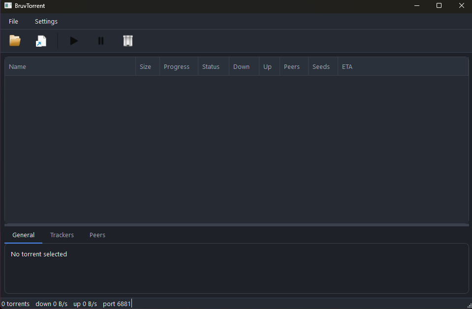

# BruvTorrent


A small BitTorrent client written from scratch in Python with a PySide6 desktop UI.
Built as a learning project: the wire protocol, piece management, trackers, and
magnet handling are all hand-rolled, no libtorrent.



## Features
- Download from `.torrent` files and magnet links (metadata fetched from peers via BEP 9)
- Single and multi-file torrents
- HTTP(S) and UDP trackers with announce-list tier fallback (BEP 12)
- Seeding: serves pieces back to peers and accepts incoming connections
- Resume: verifies data already on disk at startup and continues
- Piece pipelining with an endgame mode, SHA-1 verification per piece
- Per-torrent table with progress, speed, peers, seeds, and ETA, plus a detail
  panel for general info, trackers, and peers
- Dark and light themes

## What is not implemented
- No DHT or peer exchange (PEX). Magnet links rely on the trackers in the URI
  for peer discovery, so trackerless magnets will not find peers.
- No transport encryption (MSE/PE).
- No bandwidth limiting or per-torrent priorities.

## Requirements
- Python 3.10 or newer
- The packages in `requirements.txt`

## Installation
```bash
git clone https://github.com/Ronan-R-R/BruvTorrent.git
cd BruvTorrent
python -m venv .venv
# Linux/Mac:
source .venv/bin/activate
# Windows:
.\.venv\Scripts\activate
pip install -r requirements.txt
```

## Running
```bash
python -m src
```

On Windows, the first launch offers to add an inbound firewall rule (one UAC
prompt) so incoming peer connections and seeding work. It is remembered and not
asked again.

## Configuration
Settings live in `~/.config/BruvTorrent/settings.json` and are editable from
Settings > Preferences: download folder, listen port, theme, max connections,
and start-minimized.

## Tests
```bash
pip install pytest pytest-asyncio
pytest
```
The suite covers bencode, torrent parsing, the piece manager, and a loopback
integration test that downloads a file from a local seeding instance.

## Project layout
```
src/
  core/      bencode, torrent, tracker, peer, piece_manager, session, engine
  ui/        main_window, themes, settings, formatting
  utils/     config, logger, network_utils
tests/
```

## License
MIT
