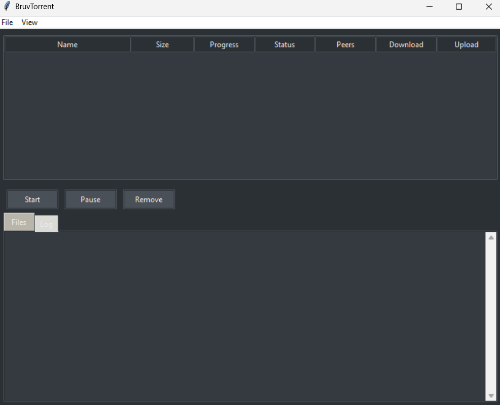

# BruvTorrent
A Python BitTorrent client with GUI, built with modern Python 3.13.

## Preview


## Features
- Torrent file support
- Magnet links (WIP)
- Download/upload speed control
- Dark/Light mode UI

## Installation
```bash
git clone https://github.com/Ronan-R-R/BruvTorrent.git
cd BruvTorrent
python -m venv .venv
source .venv/bin/activate  # Linux/Mac
.\.venv\Scripts\activate  # Windows
pip install -r requirements.txt